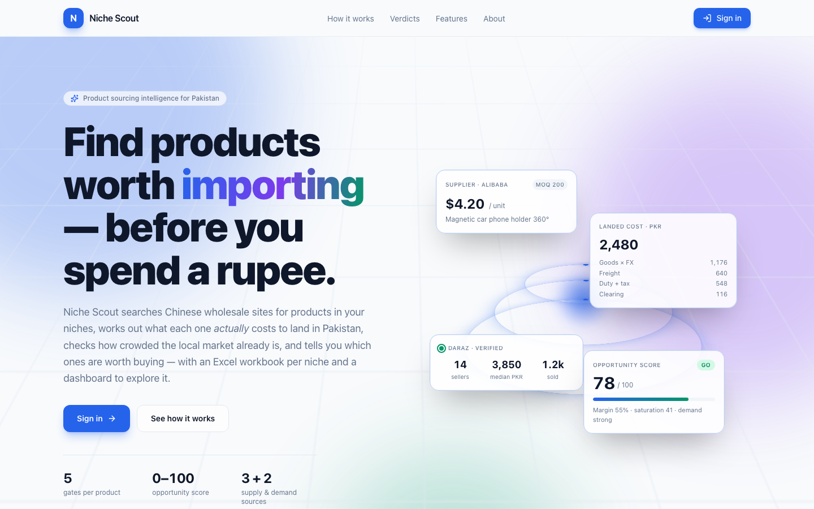
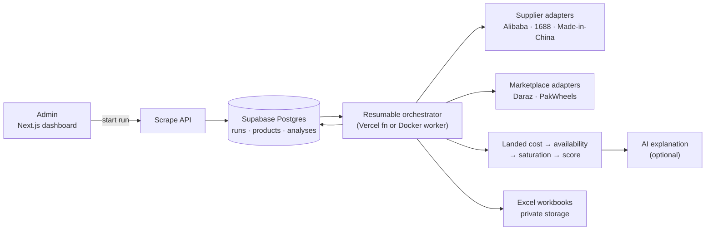
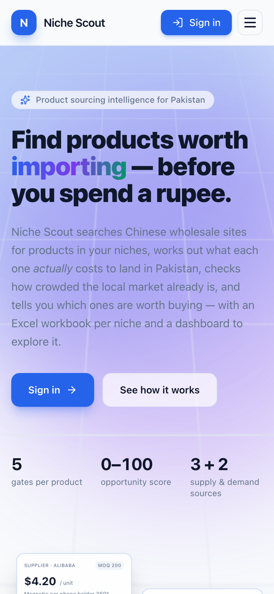

# Niche Scout

> **Find products worth importing — before you spend a rupee.**

**Live:** [niche-scout-seven.vercel.app](https://niche-scout-seven.vercel.app)
The landing page is public. The research dashboard requires an admin account.

> This is a portfolio showcase. The source code lives in a private repository.

---

## Overview

Niche Scout is a product-sourcing and market-research platform for people importing goods from China to sell in **Pakistan**.

You give it a set of product niches. It then:
1. Searches Chinese wholesale marketplaces for candidate products.
2. Works out what each one would **actually cost to land in Pakistan**.
3. Checks whether the product is really sold locally, and how crowded that market is.
4. Gives every product a **go / watch / skip** verdict, with a dashboard to explore the results and an Excel workbook per niche.

**The problem it solves:** a supplier's sticker price is misleading. A $4 item can land above PKR 2,500 once freight, duty, sales tax and clearing are added. Keyword searches on local marketplaces are just as misleading, because they return accessories and lookalike products. Doing this analysis by hand for hundreds of candidates is slow and easy to get wrong. Niche Scout does it consistently, so a sourcing decision starts from measured numbers instead of a hunch.

---

## My Role

I am the **sole developer**. I designed and built the whole platform:

- **Analysis model:** landed cost, local availability verification, market saturation, and opportunity scoring.
- **Scraping:** adapters for supplier and marketplace sites, with interchangeable fetch strategies for anti-bot-protected sources.
- **Pipeline:** a resumable scraping pipeline that works both on serverless functions with a time limit and in a long-running Docker worker.
- **AI:** integrated the AI layer with strict limits on what it's allowed to decide.
- **App and infrastructure:** built the Next.js admin dashboard, landing page, Supabase schema and security policies, Excel export, and the Vercel and Docker deployments.

---

## Key Features

- **Niche-based crawling:**
  - Searches **Alibaba, 1688 and Made-in-China** for every keyword in each niche.
  - Keyword exclusions filter out irrelevant products before anything is saved.
- **Landed-cost model:** exchange rate, freight per kg, duty and sales tax, plus clearing costs spread over the minimum order quantity. Anything above a configurable PKR ceiling is dropped early, before the more expensive market lookup.
- **Verified local availability:**
  - Daraz listings are re-read, and only those whose titles really match the product count.
  - Each product is marked *available*, *scarce*, *absent* or *unknown*, so a product with no local listings is never mistaken for an opportunity.
- **Local demand and saturation:**
  - Units sold, reviews and ratings on confirmed listings.
  - Listing count, seller count, brand concentration and price convergence combine into a saturation score.
  - PakWheels is used as a price cross-check for automotive niches.
- **Opportunity score (0–100) and verdict:**
  - **go**, **watch** or **skip**, recorded as the list of checks each product passed or failed.
  - A product can never reach "go" on an estimated selling price.
- **AI explanations:** Claude or OpenAI explains *why* a product got its verdict: what drives the result, what could make it wrong, what to do next, and a confidence rating. Each run also gets a short written summary.
- **Product lookup:** paste any supplier product URL and get a full cost, availability and score report for that one product.
- **Dynamic sources:**
  - Add a new supplier or marketplace site without writing an adapter: the AI suggests CSS selectors from a sample page.
  - Google Programmable Search suggests candidate sites for a niche.
- **Supplier trust rating:** an estimated score built from the available supplier signals, and always labelled as an estimate.
- **Learning memory:** the system suggests keywords and products with a history of "skip" verdicts, and an admin confirms before they're excluded from future runs.
- **Excel export:** a 5-sheet workbook per niche (Summary, Opportunities, Watchlist, All Products, Competitors), stored in private storage.
- **Criteria page:** shows every pipeline stage, threshold and formula using the live settings, so the documentation can't drift out of date.

---

## Technical Highlights

### Deterministic scoring, AI that explains
- Every score and verdict is calculated by plain, reproducible code. **The AI is never asked what the verdict should be.**
- AI runs *after* scoring, only to explain the result. It is limited to go/watch products by default, to control API costs.
- Everything still works without AI keys: a rule-based fallback normalises titles, and the explanation fields are filled in from the numbers alone.
- The AI provider and all thresholds are **frozen onto each run**, so old results stay explainable after settings change.

### Resumable pipeline for serverless limits
- The pipeline **saves its position to the database after every product** and stops cleanly before the serverless time limit.
- Paused runs pick themselves up again through an internal authenticated endpoint. A scheduled cron sweep is the backstop, and a cleanup job returns runs from crashed workers to the queue.
- **The database is the job queue:** in Docker, the web container only adds runs to the queue and a separate Playwright worker claims and runs them, with no time limit. The two containers never talk directly.

### Scraping under hostile conditions
- **Fetch strategy per source:** a direct request, a scraping-API proxy (ScraperAPI, ScrapingBee, Zyte, Bright Data or a custom endpoint), or a real Chromium browser via Playwright.
- Includes retries, per-host rate limiting and user-agent rotation.
- Adapters read a site's embedded page data first and fall back to parsing the page structure. **Anti-bot challenge pages and layout changes are reported as explicit errors**, not silently returned as zero results.
- **Safe AI-configured scraping:** dynamic sources are plain selector configs applied with Cheerio. Nothing the AI produces is ever executed as code.
- A plug-in registry lets a new supplier or marketplace adapter appear in the UI automatically.

### Security
- **Two layers of access:** a Supabase session is checked on every request by the Next.js 16 `proxy`, *and* the user must be on an admin allowlist stored in the database.
- The verified user ID is passed to server components in a request header. Any client-supplied copy of that header is stripped first, so it can't be spoofed.
- Postgres row-level security policies, and a private storage bucket served through signed URLs.
- The service-role key stays on the server. Internal machine-to-machine endpoints use a shared secret.

### Data and performance
- A fuzzy-text (trigram) index on product titles, plus indexes that match the dashboard's filters.
- Dashboard statistics are calculated over a bounded window of recent rows, so very large catalogues slow down gradually instead of timing out.

### Deployment
- **Vercel** (Singapore region, closest to Pakistan) with longer time limits and more memory for scrape and export functions, plus a scheduled cron job.
- **Docker:** a multi-stage build that produces a slim Next.js image and a Playwright worker image from shared dependency layers, with health checks and a non-root user.

---

## Tech Stack

**Frontend**
- Next.js 16 (App Router), React 19, TypeScript
- Tailwind CSS v4
- Recharts (colour-blind-safe palette)
- lucide-react

**Backend and data**
- Next.js Route Handlers and Server Components
- Supabase: PostgreSQL, Row-Level Security, Auth, Storage
- Zod (validation)

**Scraping**
- Cheerio, Playwright
- Pluggable scraping-API providers
- p-limit (concurrency control)

**AI and search**
- Anthropic Claude or OpenAI (selectable per deployment)
- Google Programmable Search

**Output**
- ExcelJS

**Infrastructure**
- Vercel (functions, cron)
- Docker and Docker Compose (web plus Playwright worker)

---

## Architecture

📐 **Detailed diagrams:** [architecture/architecture.md](architecture/architecture.md)
- Scoring pipeline
- Resumable run state machine
- Deployment topologies
- Data model

---

## Screenshots

| Landing page (desktop) | Landing page (mobile) |
|---|---|
|  |  |

Full landing page: [screenshots/03-landing-full-page.png](screenshots/03-landing-full-page.png)

*Dashboard screenshots will be added later.*

---

## Responsible Scraping

Niche Scout is built to scrape politely: per-host rate limiting, configurable delays, and a clear error when a site blocks automated access. It's meant to be used only on data you're permitted to collect, within each site's terms.

---

*Source code is private. Happy to walk through the architecture or code in an interview.*
