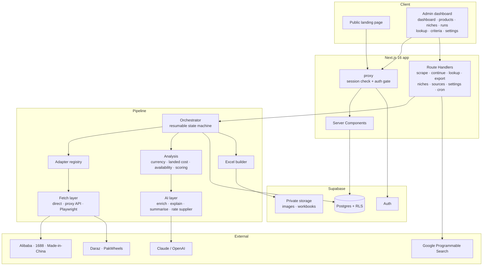
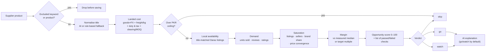
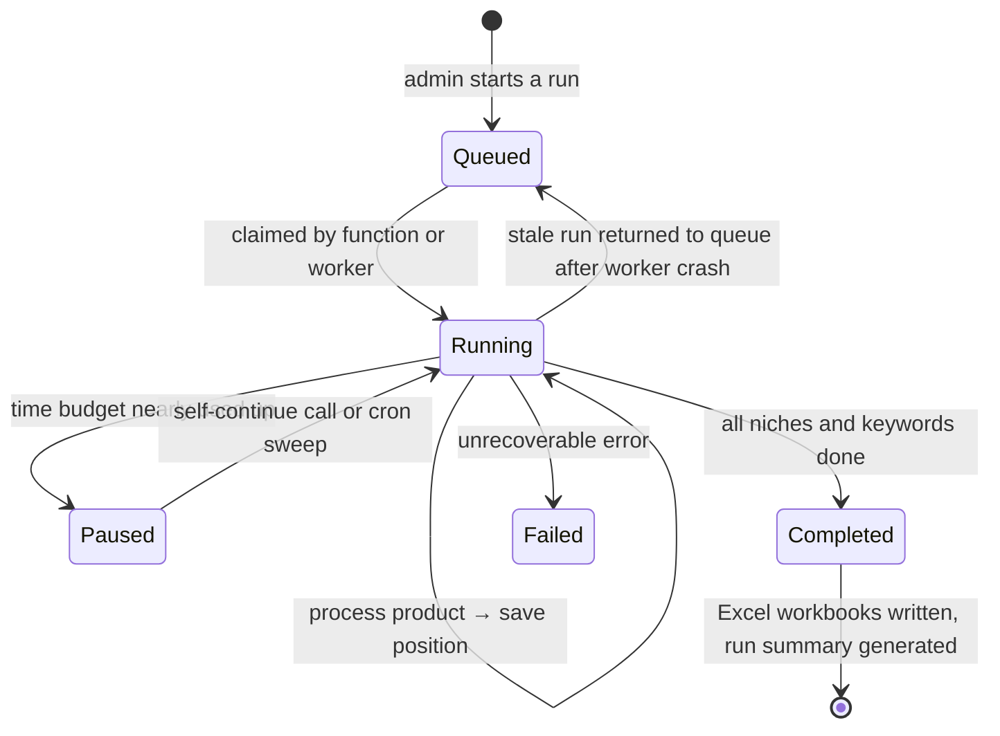
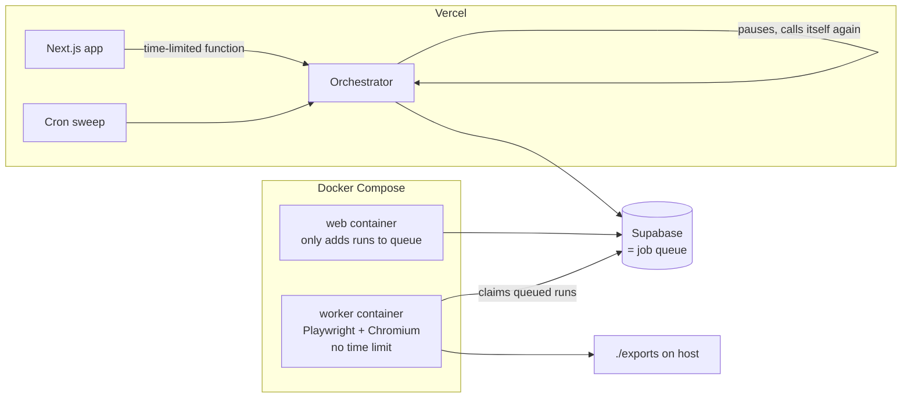

# Niche Scout — Architecture

This document explains how Niche Scout is built at a high level. It contains no implementation code.

---

## 1. System overview

---

## 2. Scoring pipeline (per product)

The stages run from cheapest to most expensive, so products that fail early never cost a market lookup or an AI call.

**Availability states:**

| State | Meaning |
|---|---|
| **available** | Sold locally; the price band is measured |
| **scarce** | Sold locally, but too few listings to trust the price band |
| **absent** | Not sold locally; any selling price is an assumption |
| **unknown** | The marketplace lookup failed, so nothing can be said about the market |

A product can reach **go** only with a measured local price. Promising products whose price is only estimated are capped at **watch**.

---

## 3. Resumable run state machine

- **Saved position:** the run's progress is written to the database after every product, so any process can pick it up.
- **Snapshot:** thresholds and the AI provider are copied onto the run when it starts.

---

## 4. Deployment topologies

| | Vercel | Docker |
|---|---|---|
| Time limit | Per-function limit, handled by pausing and resuming | None, the worker runs a whole crawl |
| Browser | None, uses a scraping API for protected sites | Real Chromium |
| Dispatch | Runs inside the web app | Web adds to the queue, the worker runs it |

---

## 5. Data model

| Table | Purpose |
|---|---|
| **admin_users** | The allowlist of users who can access the dashboard |
| **settings** | Global thresholds, landed-cost model, AI provider |
| **niches** | Niche definitions: keywords, excluded keywords, category |
| **niche_keyword_exclusions** | Admin-confirmed keywords to stop searching |
| **dynamic_sources** | Admin-added sources with AI-suggested selector configs |
| **scrape_runs** | Run status, saved position, frozen settings, AI summary |
| **products** | Discovered supplier products, including landed cost and exclusion flag |
| **market_analyses** | Per-run availability, demand, saturation, score, verdict, reasoning |
| **exports** | Excel workbooks generated per run |

**Supporting objects:**
- **View:** a combined product-insights view.
- **Indexes:** a fuzzy-text (trigram) index on product titles, plus indexes on verdict, score, cost and run.
- **Access control:** row-level security policies and helper functions for the admin and editor roles.
